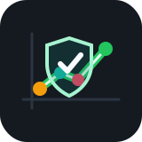
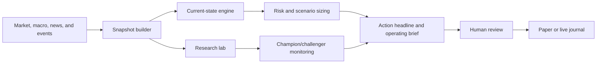
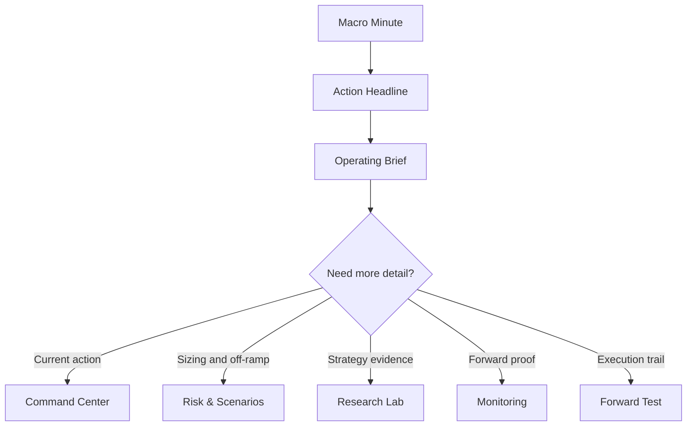

<div align="center">
  
  <h1>Trade Bot Operations</h1>
  <p><strong>Regime-aware trading research, risk sizing, and paper-monitoring cockpit.</strong></p>
  <p>
    
    
    
    
  </p>
</div>

---

Trade Bot turns market prices, macro series, curated news/events, scenario probabilities, and research experiments into a daily operating readout. It is built to answer what changed, what it implies for risk, what should be paper-tested or manually reviewed, and how candidate strategies are performing forward.

**This system does not place trades automatically.** It is decision support for human-reviewed, long-only swing and momentum research.

## Quick Navigation

| Need | Start Here | Result |
| --- | --- | --- |
| Run the system today | [Daily Operating Loop](#daily-operating-loop) | Fresh snapshot, warehouse migration, paper valuation, dashboard readout |
| Understand the dashboard | [Dashboard Map](#dashboard-map) | What each tab is for and where actions live |
| Start paper monitoring | [Start Paper Monitoring From The Dashboard](#start-paper-monitoring-from-the-dashboard) | Champion/challenger/reference windows seeded with paper capital |
| Inspect strategy evidence | [Research Lab](#research-lab) | Performance, allocation behavior, robustness, and mechanics |
| Extend ML research | [ML Research Framework](docs/ml_research_framework.md) | Targeted ML/Bayesian seams, cadence, and validation gates |
| Check formulas | [Formula Audit](#formula-audit) | Locked math definitions and validation commands |

## System At A Glance

| Layer | What It Does | Primary Output |
| --- | --- | --- |
| Data intake | Pulls price, macro, news, and event inputs into local caches. | Reusable local data and current signal inputs |
| Snapshot builder | Freezes the current market state, scenarios, recommendations, and research artifacts. | Fast dashboard snapshot |
| Risk engine | Applies scenario-aware sizing, factor risk, stress, drawdown, and constraint logic. | Risk budget and target posture |
| Research loop | Tests strategy ideas across windows, regimes, and walk-forward diagnostics. | Candidate scorecards and curated operating systems |
| Monitoring | Tracks champion/challenger/reference paper windows forward from a chosen start date. | Paper valuations and promotion/demotion evidence |
| Forward Test | Locks recommendations and records paper/live executions for auditability. | Exact recommendation and trade journal trail |

## Operating Flow



## Operating Principles

- Human review is mandatory before any real trade.
- Long-only stocks and ETFs are the default. No default derivatives, shorting, or automated execution.
- Holding periods are measured in trading days and weeks, not minutes.
- Backtests must be judged across full history, recent windows, regime shifts, and walk-forward holdouts.
- Current-state recommendations and future-scenario research are related but separate systems.
- Risk management, position sizing, and off-ramp behavior matter as much as return forecasts.

## Environment

This repo is pinned to Python 3.12.6 through `pyenv` and uses Poetry for dependency and environment management. Poetry is configured locally to keep the virtualenv in `.venv`.

```bash
pyenv install -s 3.12.6
pyenv local 3.12.6
poetry env use "$(pyenv which python)"
poetry install
```

Run project commands through Poetry so the correct interpreter and dependencies are always used.

## Quick Start

Run this from the repo root.

```bash
poetry run trade-bot fetch-prices --config configs/baseline.yaml
poetry run trade-bot build-snapshot --config configs/baseline.yaml --events configs/events.yaml --macro configs/macro_fred.yaml --news configs/news_sources.yaml
poetry run trade-bot migrate-warehouse
poetry run trade-bot seed-monitoring-windows --start-date YYYY-MM-DD --top-n 5 --capital-base 10000
poetry run trade-bot run-paper-valuation
poetry run streamlit run src/trade_bot/dashboard/app.py --server.port 8501
```

Use the latest snapshot market date for `YYYY-MM-DD`; check it with:

```bash
poetry run trade-bot list-snapshots --limit 10
```

Then open `http://localhost:8501`.

Most dashboard opens should use the sidebar default, `Latest snapshot (fast)`. Use `Live pipeline` only when you intentionally want the dashboard open to recompute the full pipeline.

## Daily Operating Loop

| Step | Command or Dashboard Area | Purpose |
| --- | --- | --- |
| 1 | `build-snapshot` | Refresh the current market, macro, news, scenario, and strategy state. |
| 2 | `migrate-warehouse` | Mirror local artifacts into the canonical DuckDB warehouse. |
| 3 | `run-paper-valuation` | Update forward paper monitoring windows from the latest snapshot. |
| 4 | Dashboard top readout | Read Macro Minute, Action Headline, Operating Brief, and Decision Brief. |
| 5 | Monitoring | Check champion/challenger forward performance and paper windows. |
| 6 | Forward Test | Lock recommendations and log paper/live executions when action is warranted. |

Daily commands:

```bash
poetry run trade-bot build-snapshot --config configs/baseline.yaml --events configs/events.yaml --macro configs/macro_fred.yaml --news configs/news_sources.yaml
poetry run trade-bot migrate-warehouse
poetry run trade-bot run-paper-valuation
poetry run streamlit run src/trade_bot/dashboard/app.py --server.port 8501
```

Add refresh flags only when needed:

```bash
poetry run trade-bot build-snapshot --refresh-data --refresh-macro --refresh-news
```

## Dashboard Map

The dashboard is intentionally organized from action to evidence. Start at the top, then drill only where needed.



| Section | Use It For | Primary Questions |
| --- | --- | --- |
| Top-Level Readout | One-screen operating posture | Is today do-nothing, small-action, or critical-action? What changed? |
| Command Center | Current-state trade decision | What is the target posture, and which tickers are affected? |
| Risk & Scenarios | Off-ramp and sizing discipline | Are factor risk, stress loss, scenarios, or expected shortfall forcing lower risk? |
| Research Lab | Strategy research and diagnostics | Which approaches worked, why, and across which windows/regimes? |
| Monitoring | Champion/challenger forward paper testing | Which monitored systems are ahead, lagging, or in drawdown review? |
| News & Macro | Narrative and macro source review | What news or macro pressure is active, stale, or missing? |
| Performance | Backtest and selected-window charts | Did the approach work recently and through transitions? |
| Forward Test | Recommendation and execution journal | What was recommended, what was done, at what price, and why? |

### Top-Level Readout

The top of the app is the operating surface. It is designed to answer three questions before you look at any tables:

- What kind of day is this: do nothing, small actions, or critical actions?
- What action is recommended and how large is the target-position change?
- Why did the system change posture: price/trend, macro, news, scenario probabilities, or portfolio-risk constraints?

Key cards:

- **Macro Minute**: current market situation, scenario pressure, new/recent changes, news/event pressure, and the practical action read-through.
- **Action Headline**: severity score, risk state, largest target change, active news, and open tickets.
- **Default Paper Book Alignment**: whether the paper book reflects the latest default target posture.
- **Operating Brief**: conclusion, recommended action, sizing translation, scenario incorporation, risk constraints, and bias check.
- **Decision Brief**: plain-English explanation of what to do next and what would change the recommendation.
- **Metric Guide**: hover/table explainers for metrics that are easy to misuse.

### Research Lab

Use this for strategy research, not same-day execution. It contains the experiment monitor, approach detail, performance-over-time views, allocation behavior, mechanics, robustness diagnostics, candidate manifests, and signal-inclusion tests.

Important distinction: a promoted experiment is not automatically live-operable. It means the idea deserves monitoring or implementation. A strategy becomes paper-operable only when it exists in the runtime pipeline and can be valued in snapshots.

### Monitoring

Use this for champion/challenger forward testing. It reads from the canonical DuckDB warehouse and shows active paper windows, ranked experiment candidates, reference portfolios, valuation status, snapshot metrics, strategy registry rows, and warehouse health.

Open **Monitoring Controls** to start monitoring an experiment or change an active window. Pick a strategy, choose `champion`, `challenger`, or `reference`, set the mode/account label, and assign paper capital. Use separate account labels when the same strategy should be monitored as multiple sleeves or capital sizes. Leave `Only champion` unchecked if multiple active champions are intentional.

Current paper monitoring starts at the configured capital base. The first valuation row is intentionally `0.00%` return; subsequent rows compound from future snapshots. This avoids treating full-history backtest growth as forward paper performance.

## Common Operator Workflows

### Start Paper Monitoring From The Dashboard

Use this when you want a controlled, visible setup without remembering CLI flags.

1. Build or load a current snapshot.
2. Run `poetry run trade-bot migrate-warehouse` so the Monitoring page sees the latest experiments, registry rows, journal rows, and snapshot metrics.
3. Open the dashboard and go to **Monitoring -> Monitoring Controls -> Start Monitoring**.
4. Choose a candidate set:
   - `Top experiments`: curated operational candidates.
   - `Reference portfolios`: static policy baselines.
   - `All registry`: every registered strategy, including research-only rows.
5. Pick the strategy, set `Mode = paper`, choose `champion`, `challenger`, or `reference`, set an account label, set paper capital, and click **Start / Update Monitoring**.
6. Run `poetry run trade-bot run-paper-valuation` after the next snapshot so the window receives a forward valuation row.

Use account labels deliberately. `core_paper_roster`, `top3_monitoring_rank`, and `small_sleeve_test` can all coexist as separate paper books, but keep only one or two active accounts unless you are intentionally running a comparison.

### Start Paper Monitoring From The CLI

Seed paper monitoring windows from the top ranked strategy registry entries. The default is 5 so Monitoring stays focused; reference portfolio policies are retained as comparison anchors.

```bash
poetry run trade-bot migrate-warehouse
poetry run trade-bot seed-monitoring-windows --start-date YYYY-MM-DD --top-n 5 --capital-base 10000
poetry run trade-bot run-paper-valuation
```

Show active monitoring windows:

```bash
poetry run trade-bot list-monitoring-windows
```

Show champion/challenger status:

```bash
poetry run trade-bot list-champion-challenger
```

To manually add one strategy to paper monitoring:

```bash
poetry run trade-bot monitor-strategy STRATEGY_NAME --role challenger --mode paper --account default_paper_account --capital-base 10000 --start-date YYYY-MM-DD
```

To make one strategy the only active champion for a paper account:

```bash
poetry run trade-bot monitor-strategy STRATEGY_NAME --role champion --mode paper --account default_paper_account --capital-base 10000 --start-date YYYY-MM-DD --demote-other-champions
```

### Add The Top 3 Promotion-Score Strategies

There are two different meanings of "top 3".

The fast operational path uses monitoring rank, which considers operability, validation tier, snapshot Calmar, selection-adjusted promotion score, and raw promotion score:

```bash
poetry run trade-bot migrate-warehouse
poetry run trade-bot seed-monitoring-windows --mode paper --account top3_monitoring_rank --capital-base 10000 --top-n 3 --start-date YYYY-MM-DD
poetry run trade-bot run-paper-valuation
```

If you literally want the raw top 3 by `promotion_score`:

1. Go to **Research Lab -> Experiment Monitor -> Leaderboard**.
2. Sort by `promotion_score` descending.
3. Copy the top three strategy names.
4. Go to **Monitoring -> Monitoring Controls -> Start Monitoring**.
5. Candidate set should usually be `All registry`.
6. Add the first as `champion` and the next two as `challenger`, with `Mode = paper`, `Account label = top3_promotion_score`, and the same paper capital.
7. Run `poetry run trade-bot run-paper-valuation` after adding them.

### Decision-Sanity Overlay Testing

The dashboard recommendation layer includes a decision-sanity guardrail: large news/event-only de-risking should not automatically force a huge cash move unless price, credit, volatility, breadth, or trend confirmation also deteriorates. That rule is not assumed to be good by default. It is backtested as paired raw-versus-capped experiments.

```bash
poetry run trade-bot run-experiment-iteration --config configs/baseline.yaml --iteration 77 --output-dir data/experiments_reset_v2
poetry run trade-bot run-experiment-iteration --config configs/baseline.yaml --iteration 78 --output-dir data/experiments_reset_v2
```

Dashboard path: **Research Lab -> Experiment Monitor -> Sanity Impact**.

Use that tab to compare profile-level adoption reads and pair-level deltas. A positive `delta_max_drawdown` means the capped version had a less negative drawdown. A negative `delta_promotion_score` means the capped version scored worse after the validation penalties.

### Change Champion, Challenger, Or Window Status

Dashboard path:

1. Go to **Monitoring -> Monitoring Controls -> Manage Active Windows**.
2. Select the active window.
3. Change `Role`, `Status`, or `Paper capital`.
4. Check `Only champion` if this champion should demote other active champions for the same mode/account.
5. Click **Apply Window Changes**.

CLI path:

```bash
poetry run trade-bot list-monitoring-windows --status all
poetry run trade-bot update-monitoring-window WINDOW_ID --role champion --demote-other-champions
poetry run trade-bot update-monitoring-window WINDOW_ID --status paused
poetry run trade-bot update-monitoring-window WINDOW_ID --status closed
```

Window roles are `champion`, `challenger`, and `reference`. Window statuses are `active`, `paused`, `closed`, `killed`, and `archived`.

### Monitoring Versus Forward Test

These are intentionally different workflows.

| Workflow | What It Tracks | When To Use |
| --- | --- | --- |
| Monitoring | Forward paper valuation windows for champion/challenger/reference strategies. | Use for paper performance evidence and promotion/demotion decisions. |
| Forward Test | Locked recommendation tickets and manually logged paper/live executions. | Use when the current trade decision says to act and you need an audit trail. |

Starting paper monitoring does not automatically create trade tickets. Lock tickets in **Forward Test** only after reviewing the current recommendation and deciding to paper-trade or live-trade that action.

### Monitoring State Labels

The Monitoring tab uses state labels to show whether a strategy can be valued forward.

| State | Meaning |
| --- | --- |
| `active_valued` | Active monitoring window exists and has at least one paper valuation row. |
| `active_awaiting_valuation` | Active window exists and the strategy is snapshot-ready, but valuation has not run yet. |
| `active_research_only` | Active window exists, but the strategy is not currently reconstructable from the latest snapshot. |
| `available_to_seed_and_value` | Not active yet, but it can be started and valued from snapshots. |
| `available_research_only` | Visible for research, but not currently snapshot-ready for daily paper valuation. |

Prefer `active_valued` or `available_to_seed_and_value` for serious paper monitoring. Treat research-only rows as ideas to inspect, not as complete forward-monitoring systems.

## Common Gotchas

| Symptom | Likely Cause | Fix |
| --- | --- | --- |
| Dashboard feels stale | Fast mode is reading the last completed snapshot. | Build a new snapshot, then refresh the dashboard. |
| Monitoring is empty | Warehouse has not been migrated or no windows are seeded. | Run `migrate-warehouse`, then seed or start windows. |
| Candidate appears in Research Lab but cannot be valued | It is research-only or missing runtime reconstruction support. | Inspect it in Research Lab; only paper-monitor it after it becomes snapshot-ready. |
| Paper return is `0.00%` on the first row | First valuation starts at capital base by design. | Keep collecting future snapshot valuations. |
| `seed-monitoring-windows --top-n 3` does not match raw promotion-score rank | Seeding uses monitoring rank, not raw score alone. | Use Research Lab leaderboard and manually add strict raw-score candidates. |
| Champion/challenger table does not update after starting a window | Valuation has not run after the window was created. | Run `poetry run trade-bot run-paper-valuation`. |
| Recommendation changed but paper book still looks old | Forward Test executions and Monitoring windows are separate from current target recommendations. | Lock/log execution in Forward Test or update the monitored window as appropriate. |
| Many tiny daily changes show up | Strategy may be too active for human execution. | Inspect turnover/action frequency in Research Lab before promoting it. |

## Storage Model

The system intentionally keeps all storage local.

| Location | Purpose |
| --- | --- |
| `data/cache/` | Cached market, macro, and news inputs. |
| `data/run_store/trade_bot.duckdb` | Canonical DuckDB warehouse and snapshot metadata. |
| `data/run_store/snapshots/` | Pickled snapshot artifacts for fast dashboard cold starts. |
| `data/trading_journal.sqlite` | Local trade-journal source used by the Forward Test UI. |
| `reports/experiments/` | Experiment iteration CSVs and summaries. |
| `reports/baseline_report.html` | Static HTML report from baseline runs. |

Keep `.env`, `.venv/`, `data/`, `reports/`, DuckDB files, parquet files, CSV exports, and local caches out of Git unless there is a deliberate reason to version a small fixture.

## Snapshot And Warehouse Commands

| Task | Command |
| --- | --- |
| List snapshots | `poetry run trade-bot list-snapshots --limit 10` |
| List background jobs | `poetry run trade-bot list-snapshot-jobs --limit 10` |
| Migrate warehouse | `poetry run trade-bot migrate-warehouse` |
| Seed monitoring | `poetry run trade-bot seed-monitoring-windows --start-date YYYY-MM-DD --top-n 5 --capital-base 10000` |
| Add one strategy | `poetry run trade-bot monitor-strategy STRATEGY_NAME --role challenger --mode paper --capital-base 10000 --start-date YYYY-MM-DD` |
| Change a window | `poetry run trade-bot update-monitoring-window WINDOW_ID --role champion --demote-other-champions` |
| Run paper valuation | `poetry run trade-bot run-paper-valuation` |
| List windows | `poetry run trade-bot list-monitoring-windows` |
| Champion/challenger | `poetry run trade-bot list-champion-challenger` |

## Research Loop

Strategy research runs in bounded batches. One iteration tests 3-10 candidates, scores them, and marks each as promote, evolve, or reject.

The intended end state is 1-3 operational systems, not a dashboard full of live strategies. Research should go broad first, then deep:

| Phase | Meaning |
| --- | --- |
| Broad | Many hypotheses, overlays, universes, and risk rules. |
| Deep | Walk-forward testing, regime holdouts, left-tail windows, overfit diagnostics, and forward paper monitoring. |
| Operational | Promote only systems that can be explained, valued, monitored, and acted on with human latency. |

Reference portfolio policies are included so simple allocations stay visible beside tactical systems. Active-trading probes use `configs/active_trading.yaml`, which applies daily rebalancing checks, next-day signal lag, and higher transaction-cost assumptions.

```bash
poetry run trade-bot run-experiment-iteration --config configs/baseline.yaml --iteration 41
poetry run trade-bot run-experiment-iteration --config configs/active_trading.yaml --iteration 42
poetry run trade-bot migrate-warehouse
```

See [docs/iteration_protocol.md](docs/iteration_protocol.md), [docs/creative_strategy_backlog.md](docs/creative_strategy_backlog.md), and [docs/experiment_plan.md](docs/experiment_plan.md).

## Formula Audit

The locked math, formula definitions, model semantics, and drift-control rules live in [docs/math_model_audit.md](docs/math_model_audit.md). Any change to core backtest, risk, scenario, trade-decision, paper-valuation, or experiment formulas should update that document and the corresponding formula-contract tests.

Run validation before trusting changes:

```bash
poetry run black --check src tests
poetry run ruff check --no-cache src tests
poetry run pytest -p no:cacheprovider
```

## Sharing The Dashboard

Do not expose Streamlit directly to the public internet. For temporary demos with users, prefer a private network tool such as Tailscale or a controlled tunnel. Shared users should start as read-only viewers.

Before broader sharing, add or enable:

- lightweight app login
- read-only roles for viewers
- hidden or disabled state-changing controls for non-admin users
- redaction of exact account values and secrets
- clear paper-only and not-investment-advice demo labeling

## Troubleshooting

If the dashboard is slow on cold start, check that a snapshot exists and the sidebar is set to `Latest snapshot (fast)`.

```bash
poetry run trade-bot list-snapshots
```

If the Monitoring section is empty, seed and value the warehouse.

```bash
poetry run trade-bot migrate-warehouse
poetry run trade-bot seed-monitoring-windows --start-date YYYY-MM-DD
poetry run trade-bot run-paper-valuation
```

If CLI commands use the wrong Python, confirm pyenv and Poetry are aligned.

```bash
python --version
poetry run python --version
poetry env info
```

If Codex keeps requesting file approvals after a repo move, start a fresh Codex session rooted at the actual repo path.

## Project Boundary

This is a private local research project. It should stay separate from work infrastructure and data. See [docs/project_boundaries.md](docs/project_boundaries.md) for the dependency and operating rules, including how any optional `lib-aim-timeseries` reuse should be isolated behind adapters.

## Not Investment Advice

This system is research tooling and decision support. It does not guarantee returns, does not remove market risk, and should not be treated as investment advice.
